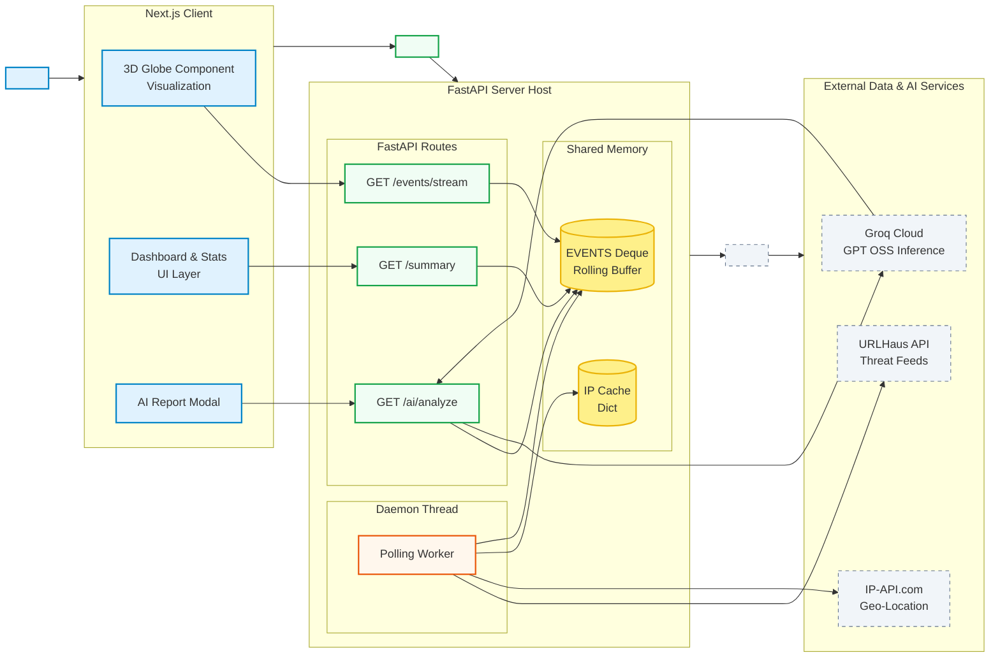

## 🌐 Global Cyber Threat Visualisation Platform
#### A streamed cyber threat monitoring and visualisation platform that aggregates malicious activity from open threat intelligence sources and renders it on an interactive 3D globe.
This project is built under Open Innovation – IT Services, focusing on security observability, threat intelligence aggregation, and real-time visual analytics.


## Data Sources
* **URLHause (abuse.ch)**
    * Updates every few minutes
    * Includes malware tags & classfication
* **SPAMHAUS**
* **ip-api**
    * Geo-location enrichment
    * Local Caching of IPs

## Server (FastAPI)
### Features
* Background polling daemon
* Event buffering using `deque`
* Geo-IP caching to minimize repeated lookups

### Sample Event Structure
```json
{
  "lat": 37.77,
  "lng": -122.41,
  "attack_format": "malware_download",
  "severity": "high",
  "source": "urlhaus",
  "timestamp": 1700000000
}
```

### System Architecture
The following Mermaid diagram illustrates an overview of system architecture and data flow: 



### Setup
#### Server (Using UV)
* Run the commands 
```bash
cd $server
uv sync
uv run fastapi dev --port 5000
```
#### Client (Nextjs)
* Run the commands
```bash
bun install 
bun dev
```

### Application Screenshot

